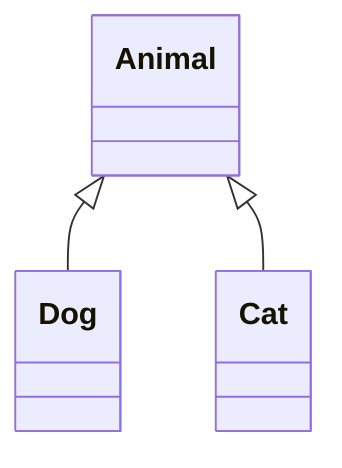

# 다형성

polymorphism

| 다형성 | 컴파일 시간 다형성 | 함수 중복 정의 |
| --- | --- | --- |
|  |  | 연산자 중복 정의 |
|  | 실행 시간 다형성 | 가상함수 |

‘실행 시간 다현성’이란 객체의 타입이 다르면 똑같은 메시지가 전달되더라도 서로 다른 동작을 하는 것을 말한다.

## 상향 형변환



```cpp
#include <iostream>
using namespace std;

class Animal
{
  public:
    void speak()
    {
        cout << "Animal speak()" << endl;
    }
};

class Dog : public Animal
{
  public:
    void speak()
    {
        cout << "Bark! Bark!" << endl;
    }
};

class Cat : public Animal
{
  public:
    void speak()
    {
        cout << "Meow~ Meow~" << endl;
    }
};

int main()
{
    Animal *pd = new Dog();
    Animal *pc = new Cat();

    pd->speak();
    pc->speak();

    delete pd;
    delete pc;
    return 0;
}
```

놀랍게도 Animal 포인터로 자식클래스인 Dog와 Cat 객체를 가리킬 수 있다.

그러나 이 코드의 실행결과는

```bash
Animal speak()
Animal speak()
```

어떤 객체를 가리키는지와 관계없이 Animal 클래스의 멤버 함수를 호출한다.

따라서 아직까지는 다형성이 동작하고 있지 않다.

## 가상함수

```cpp
class Animal
{
  public:
    virtual void speak()
    {
        cout << "Animal speak()" << endl;
    }
};
```

부모 클래스의 함수를 `virtual` 키워드로 가상 함수(virtual funtion)로 바꾸어주는 것 만으로 위 코드의 결과는

```bash
Bark! Bark!
Meow~ Meow~
```

이렇게 다형성이 동작한다.

`virtual` 키워드는 메소드에만 사용할 수 있으며, 부모클래스에서 가상함수로 정의하면 자식클래스에서는 `virtual` 키워드를 사용하지 않아도 자동으로 가상함수가 된다.

어떻게 이게 가능할까?

## 동적 바인딩

함수의 호출을 함수의 몸체와 연결하는 것을 `바인딩(binding)`이라고 한다.

바인딩에는 `정적 바인딩(static binding)`과 `동적 바인딩(dynamic binding)`이 존재한다.

| 바인딩의 종류 | 특징 | 속도 | 대상 |
| --- | --- | --- | --- |
| 정적 바인딩 | 컴파일 시간에 호출 함수가 결정된다. | 빠르다 | 일반함수 |
| 동적 바인딩 | 실행시간에 호출 함수가 결정된다. | 늦다 | 가상함수 |

클래스의 상속 구조에 따라 메서드를 가상함수로 할지 일반함수로 할지 결정하는 것 또한 최적화의 방법이라고 생각한다.

> tip : 부모클래스 포인터의 배열에 여러 자식클래스의 객체를 넣으면 반복문으로 여러 객체의 메서드를 돌릴 수 있다.
>